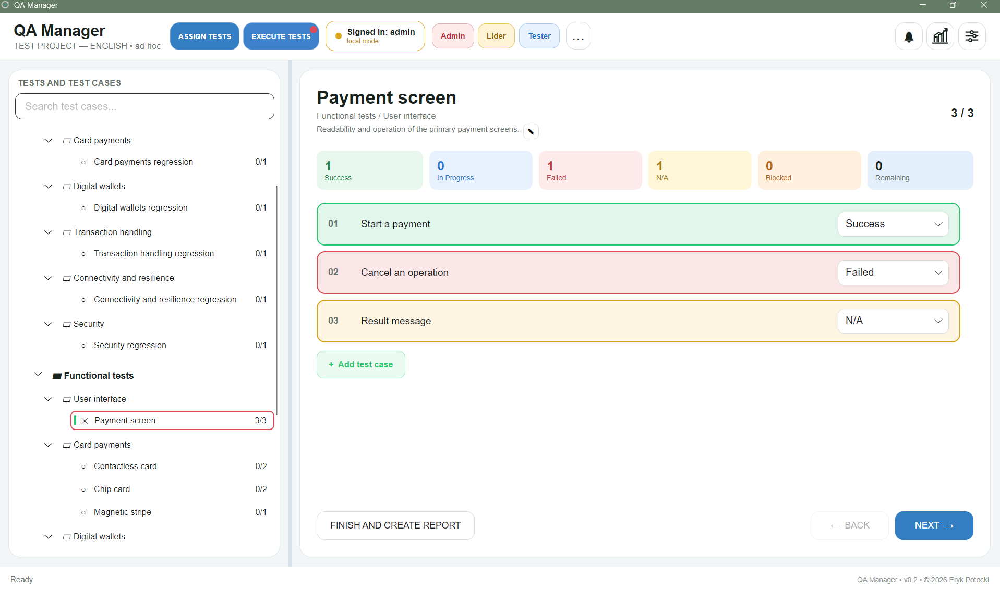
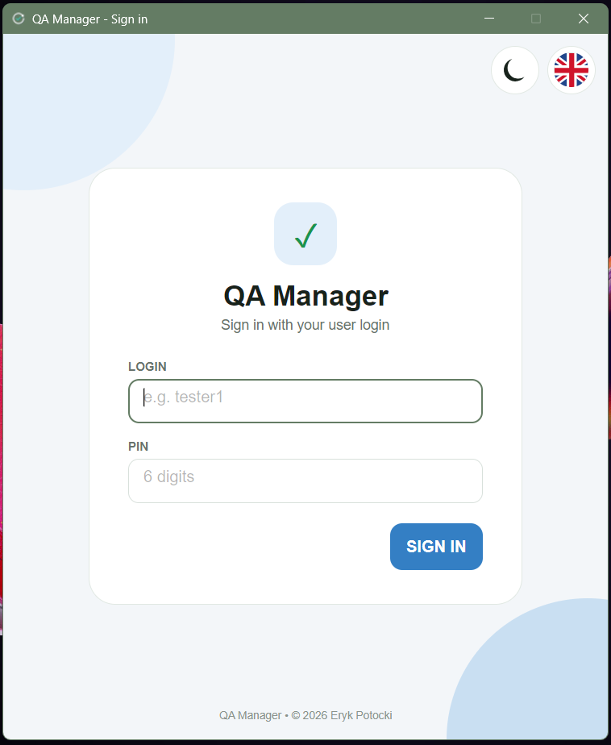
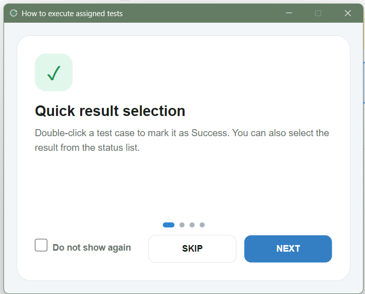
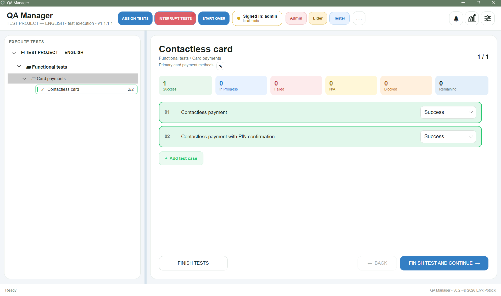
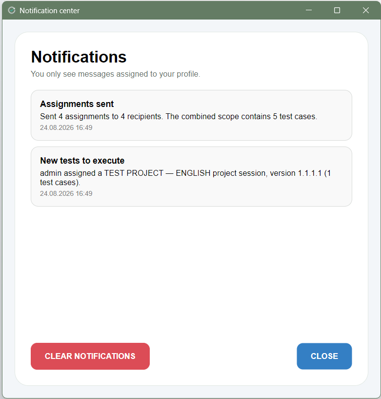
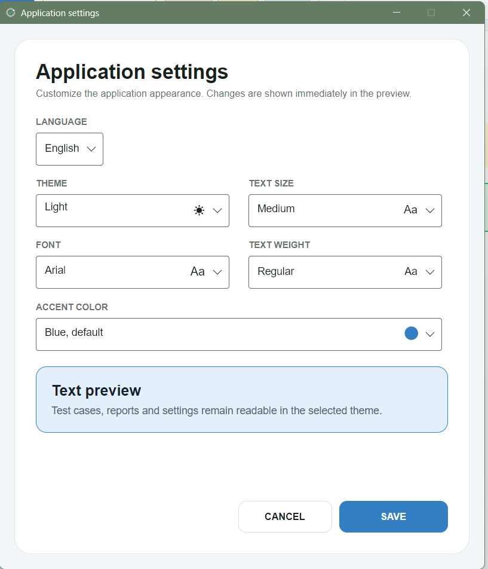

<div align="center">
  
  <h1>QA Manager — Test Center</h1>
  <p>Desktop application for managing manual test cases, assignments, execution sessions and QA progress.</p>
</div>

> Project status: active development, version line `v0.2.x`.

## Interface preview

### Test explorer and ad-hoc execution



| Sign-in | Assigned-test tutorial |
| --- | --- |
|  |  |

| Assigned test execution | Notification center |
| --- | --- |
|  |  |

### Appearance settings



The screenshots show the English interface in the Light theme. The same workflow is available in Polish and in the Dark theme.

## Features

- ad hoc and assigned test execution,
- hierarchical projects, folders, collections and test cases,
- Admin, Leader and Tester system roles plus configurable project roles,
- assignment packages, private notifications and team progress dashboard,
- active, completed and archived session tracking,
- PDF and Excel reports,
- local storage with optional encrypted HTTPS host/client synchronization,
- Polish and English interface,
- light and dark themes with per-profile appearance settings.

## Demo accounts

A fresh installation creates only synthetic demonstration accounts:

| Login | Initial PIN | System role | Default project access |
| --- | --- | --- | --- |
| `admin` | `000000` | Admin, Leader, Tester | `TEST PROJECT — ENGLISH`, `TEST PROJECT — POLISH` |
| `leader` | `000000` | Leader | None until assigned by Admin |
| `tester1` | `000000` | Tester | None until assigned by Admin |
| `tester2` | `000000` | Tester | None until assigned by Admin |

The application requires each account to replace the initial PIN during its first sign-in. These accounts and all included test cases are fictional and are not associated with any company or real person.

The Admin profile also demonstrates several colored custom QA roles: `QA Analyst`, `Automation Engineer`, `Test Architect` and `Quality Observer`. They have no project access by default and can be freely edited or removed in role management.

## Clean local state

The repository contains source code and neutral seed definitions only. On first launch, every downloaded copy creates its own local:

- profiles and PIN hashes,
- projects and demonstration test cases,
- assignments, notifications and execution sessions,
- language, theme, font and accent preferences,
- synchronization certificates and connection tokens.

Changing the Admin theme, executing a test or creating an account affects only the local application data. These values are stored under the operating-system application-data directory and are excluded from Git. They are never committed automatically.

The default appearance for a fresh profile is Light, Blue, Arial, standard text size and regular text weight.

## Default demonstration data

Admin has access to two neutral projects:

- `TEST PROJECT — ENGLISH` — folders, collections, cases, descriptions and steps in English
- `TEST PROJECT — POLISH` — foldery, zbiory, przypadki, opisy i kroki po polsku

Their folders, collections and test cases are generated locally from deterministic seed definitions. Imported or user-created project names and test cases are never translated or uploaded by the application.

## Technology

- C# and .NET 10
- Avalonia UI 12
- CommunityToolkit.Mvvm
- ClosedXML
- PDFsharp and MigraDoc

## Development

Install the .NET 10 SDK, then run:

```powershell
dotnet restore
dotnet build
dotnet run
```

Create a self-contained Windows build with:

```powershell
dotnet publish -c Release -r win-x64 --self-contained true
```

The `scripts/Build-Installer.ps1` script and `installer/QARegressionManager.iss` definition build the Windows installer.

## Data and security

No real user data, company data, PINs, generated certificates, connection files, access tokens, reports or local sessions are stored in this repository.

Host/client synchronization uses HTTPS, certificate fingerprint verification and a randomly generated access token. A generated connection file is confidential and should be shared only with authorized users.

## Repository structure

- `Models` — domain and view data models
- `Services` — storage, synchronization, sessions, reports and application logic
- `ViewModels` — presentation logic
- `Views` — Avalonia views
- `Assets` — application icon and visual resources
- `docs/screenshots` — screenshots used in this README
- `installer` — installer configuration
- `scripts` — release scripts

## Polish summary

QA Manager to aplikacja desktopowa do zarządzania testami manualnymi, przypisaniami, sesjami i raportami. Świeża instalacja zawiera wyłącznie neutralne konta oraz przypadki demonstracyjne. Wszystkie PIN-y, wyniki, ustawienia wyglądu, tokeny i dane synchronizacji są zapisywane lokalnie i nie trafiają do repozytorium.

## License

Copyright © 2026 Eryk Potocki. All rights reserved. See [LICENSE](LICENSE).
