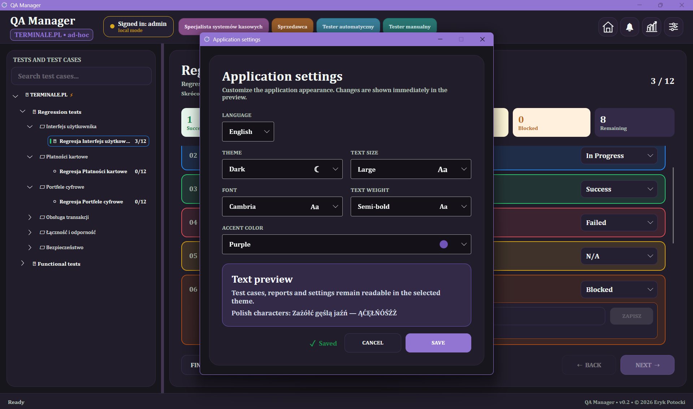
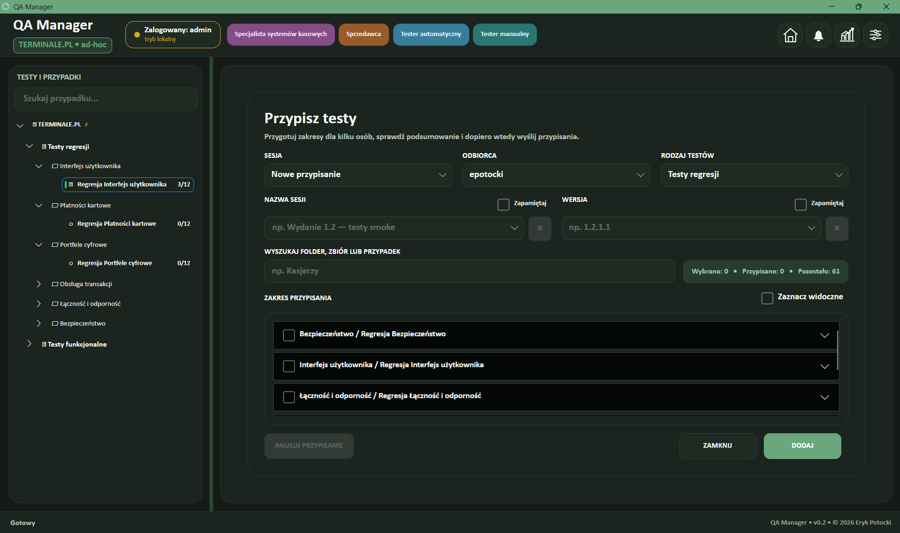
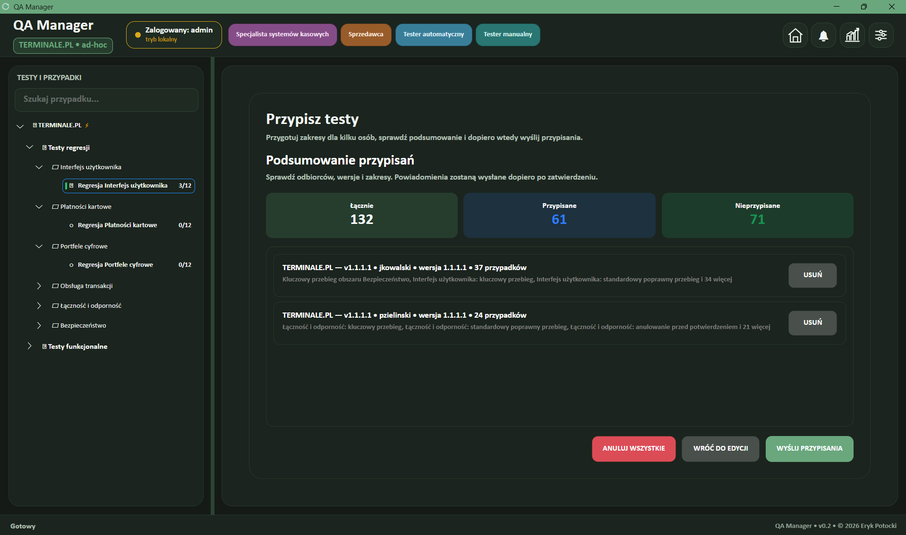
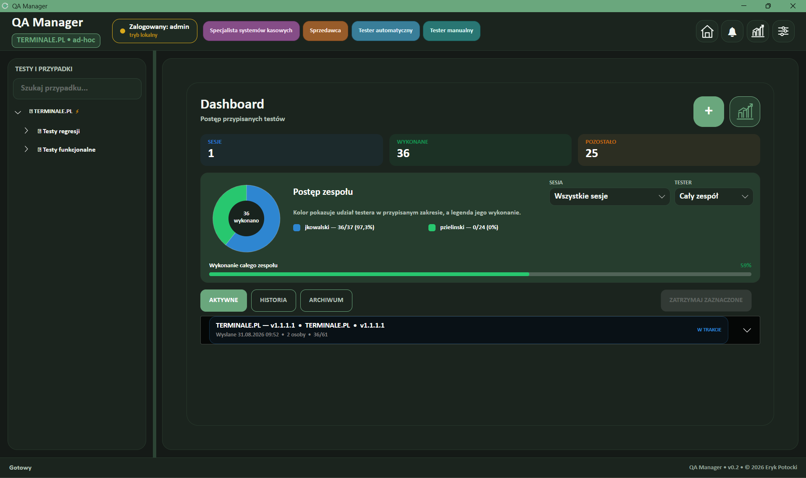
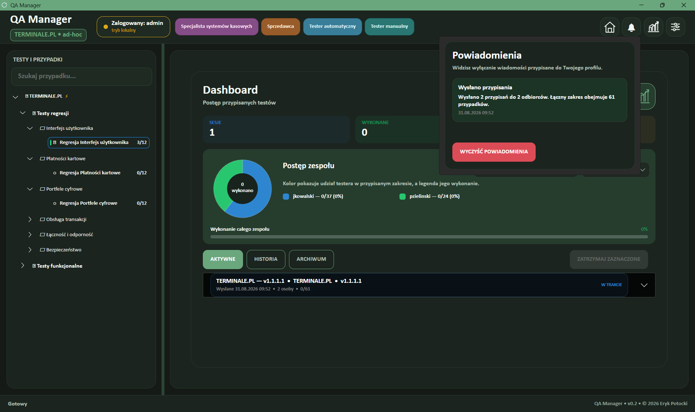
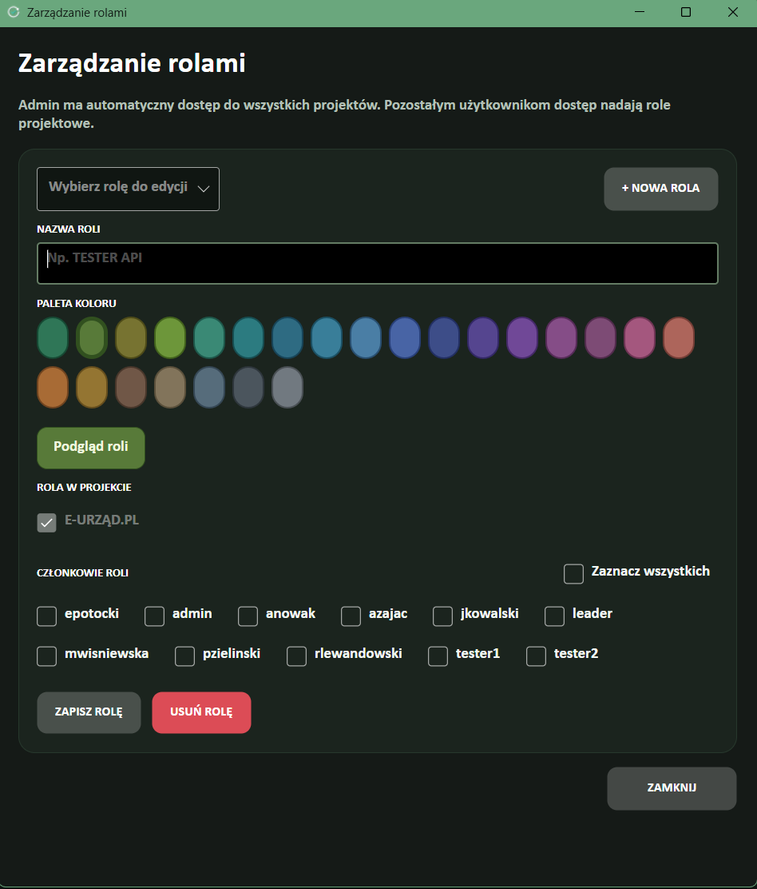
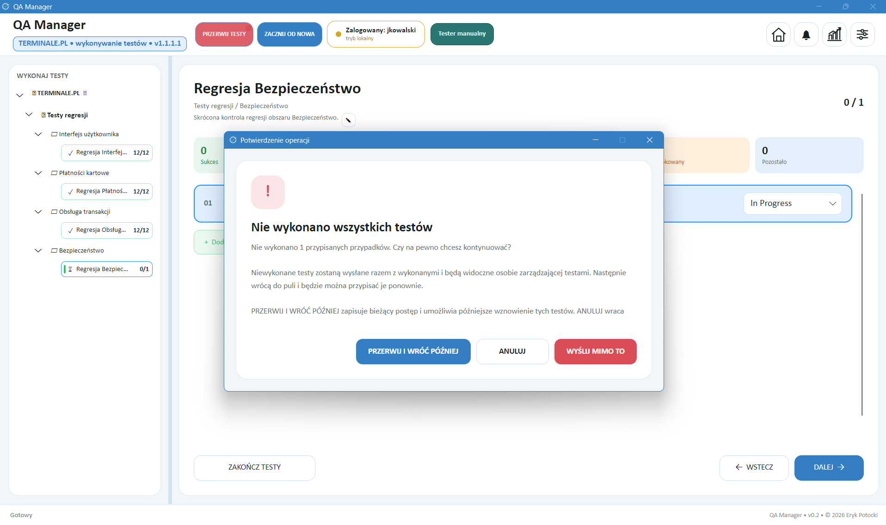

<div align="center">
  
  <h1>QA Manager — Test Center</h1>
  <p>Desktop application for managing manual test cases, assignments, execution sessions and QA progress.</p>
</div>

> Project status: active development. Current public build: `v0.2.4`.

## Download for Windows

**[Download QA Manager v0.2.4 installer](https://github.com/erykpotocki/QA-Manager-Test-Center/raw/refs/heads/main/downloads/QA-Manager-v0.2.4-Setup.exe)**

The installer contains a self-contained Windows x64 build, so installing the .NET SDK is not required. Windows may display a SmartScreen warning because this development build is not digitally signed.

The `main` branch can contain newer completed changes than the packaged installer. The installer is refreshed only when a new Windows build is prepared.

SHA-256: `19FEB5FCED4FF5ED45F459A4B9A8DABDE0652C31D48D3E994E1FAB39243F16FA`

## Interface preview

### Test execution


### Sign-in and personalization

| Sign-in | Appearance settings |
| --- | --- |
|  |  |

### Assignment workflow

| Assignment editor | Assignment summary |
| --- | --- |
|  |  |

### Team progress and notifications

| Progress dashboard | Notification center |
| --- | --- |
|  |  |

### Administration and resumable execution

| Project-role management | Pause and resume later |
| --- | --- |
|  |  |

The screenshots intentionally show different languages, themes, fonts and accent colors. These appearance choices are stored per local profile and do not change the test data.

### Main application screens

| Screen | Purpose |
| --- | --- |
| Sign-in and project selection | Authenticate a profile, replace the initial PIN and choose a project available through its assigned roles. |
| Test explorer | Browse folders, collections and cases; run ad-hoc or assigned tests and add comments. |
| Assignment editor | Select an eligible recipient, version and test scope; recipients without access to the current project cannot receive its tests. |
| Progress dashboard | Review active, completed and archived assignment packages and generate team reports. |
| Notification center | Display private assignment and completion notifications for the signed-in profile. |
| Application settings | Change language, Light/Dark theme, accent color, font, text size and weight. |
| Management and reset tools | Manage projects, roles and accounts or restore the complete synthetic test environment. |
| Computer synchronization | Create an encrypted local-network host or connect another authorized computer using a confidential connection file. |

## Features

- ad hoc and assigned test execution,
- hierarchical projects, folders, collections and test cases,
- Admin, Leader and Tester system roles plus configurable project roles,
- assignment packages, private notifications and team progress dashboard,
- recipient filtering and service-level validation based on project access,
- active, completed and archived session tracking,
- pausing unfinished assigned tests and resuming them later without submitting results,
- reusable session-name and version suggestions with local removal controls,
- PDF and Excel reports,
- local storage with optional encrypted HTTPS host/client synchronization,
- Polish and English interface,
- light and dark themes with per-profile appearance settings.

## Demo accounts

A fresh installation creates only synthetic demonstration accounts:

| Login | Initial PIN | System role | Default project access |
| --- | --- | --- | --- |
| `admin` | `000000` | Admin, Leader, Tester | All demonstration projects |
| `leader` | `000000` | Leader | `TERMINALE.PL`, `OGRODY.PL` |
| `tester1` | `000000` | Tester | `TERMINALE.PL`, `POGODA.PL` |
| `tester2` | `000000` | Tester | `TERMINALE.PL`, `SAMOCHODY.PL` |
| `tester3` | `000000` | Tester | `TERMINALE.PL`, `SZPITAL.PL` |

The application requires each account to replace the public demonstration PIN with a new six-digit PIN during its first sign-in. A global test reset sets every existing account back to `000000` and requires another PIN change. User-defined PINs are never stored in plaintext: only salted hashes are saved in the active local or host data store.

These accounts and all included test cases are fictional and are not associated with any company or real person.

The Admin profile also demonstrates colored QA roles such as `QA Analyst`, `Automation Engineer`, `Test Architect` and `Quality Observer`. Project-role membership controls which non-admin profiles can open a project and receive its assignments; roles can be edited in the management screens.

## Clean local state

The repository and installer contain source/build artifacts and neutral seed definitions, but no working user data. In local mode, the application uses a separate Windows-profile data store that can contain:

- profiles and PIN hashes,
- projects and demonstration test cases,
- assignments, notifications and execution sessions,
- language, theme, font and accent preferences,
- synchronization certificates and connection tokens.

Changing the Admin theme, executing a test or creating an account affects the active data store only. Local-mode data is kept under the operating-system application-data directory and excluded from Git. In host/client mode, authorized computers use the encrypted host data store instead. Runtime data is never committed automatically.

The default state for a fresh installation is English, Light theme, Blue accent, Calibri, standard text size and regular text weight. A global reset removes assignments, notifications, execution sessions, statuses, comments and saved form suggestions; resets all existing account PINs and appearance preferences; and leaves accounts, roles, projects and the synthetic test catalog available for another clean cycle.

An update installed over an existing copy preserves that computer's local working data. To test the true first-run experience, install on a new Windows profile or use the secured global reset inside the application.

## Default demonstration data

Admin has access to all eight neutral demonstration projects. Other profiles receive access through project roles:

| Project | Demonstration area |
| --- | --- |
| `ENGLISH.COM` | Complete English-language localization and test-catalog example |
| `OGRODY.PL` | Plants, gardens and related service workflows |
| `POGODA.PL` | Weather, forecasts and connectivity scenarios |
| `E-URZĄD.PL` | Synthetic public-service and document workflows |
| `OWOCE.PL` | Sales, inventory and delivery scenarios |
| `TERMINALE.PL` | Payment terminals, cards and digital wallets |
| `SAMOCHODY.PL` | Automotive diagnostics and service workflows |
| `SZPITAL.PL` | Synthetic healthcare registration and operational scenarios |

Their folders, collections and test cases are generated locally from deterministic seed definitions. Imported or user-created project names and test cases are never translated or uploaded by the application.

## Technology

- C# and .NET 10
- Avalonia UI 12.1.0
- CommunityToolkit.Mvvm
- ClosedXML
- PDFsharp and MigraDoc

## Development

Install the .NET 10 SDK, then run:

```powershell
dotnet restore
dotnet build
dotnet run
```

Create a self-contained Windows build with:

```powershell
dotnet publish -c Release -r win-x64 --self-contained true
```

The `scripts/Build-Installer.ps1` script and `installer/QARegressionManager.iss` definition build the Windows installer.

## Data and security

No real user data, company data, user-defined PINs, generated certificates, connection files, access tokens, reports or local sessions are stored in this repository. The public demonstration PIN `000000` is seed data only and must be replaced during first sign-in.

Host/client synchronization uses HTTPS, certificate fingerprint verification and a randomly generated access token. The address displayed by the synchronization screen is detected locally on the computer running the application; it is not taken from this repository. A generated connection file is confidential and should be shared only with authorized users.

## Repository structure

- `Models` — domain and view data models
- `Services` — storage, synchronization, sessions, reports and application logic
- `ViewModels` — presentation logic
- `Views` — Avalonia views
- `Assets` — application icon and visual resources
- `docs/screenshots` — screenshots used in this README
- `downloads` — ready-to-install Windows builds
- `installer` — installer configuration
- `scripts` — release scripts

## Polish summary

QA Manager to aplikacja desktopowa do zarządzania testami manualnymi, przypisaniami, sesjami i raportami. Świeża instalacja uruchamia się po angielsku, w jasnym motywie i zawiera neutralne profile `admin`, `leader`, `tester1`, `tester2`, `tester3` oraz osiem syntetycznych projektów. Każdy profil poza administratorem ma domyślnie dostęp do `TERMINALE.PL` i jednego dodatkowego projektu. Początkowy PIN to `000000` i musi zostać zmieniony przy pierwszym logowaniu. Testy można przypisać wyłącznie osobie mającej dostęp do danego projektu. Dane robocze, hashe PIN-ów, ustawienia wyglądu, tokeny i dane synchronizacji nie trafiają do repozytorium.

## License

Copyright © 2026 Eryk Potocki. All rights reserved. See [LICENSE](LICENSE).
